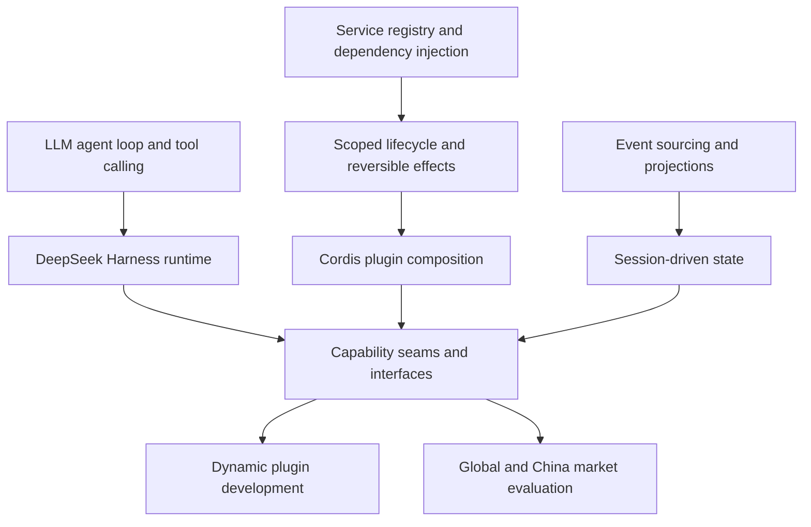

# DeepSeek Harness

[Back to the learning library](../README.md)

## Learning goal

This curriculum teaches experienced engineers and technical product leaders how DeepSeek Harness `v0.1.0-rc.7` works as an Agent runtime, how Cordis makes its runtime composable, how sessions and capabilities behave, how to develop a dynamic plugin, and how to evaluate the project in global and China markets. The instructional language is Chinese; Skill names, source identifiers, APIs, and code terms remain in English.

## Vocabulary

| Term | Meaning in this curriculum | Common confusion |
| --- | --- | --- |
| Model | The LLM that predicts assistant text and tool calls | A model does not itself own files, terminals, permissions, or durable sessions |
| Agent | A model-driven process that observes state, selects actions, and continues until a stopping condition | An Agent is not only a prompt template |
| Harness | The execution and control layer around the model and Agent loop | A Harness is broader than an SDK wrapper |
| Plugin | A Cordis contribution mounted into a scoped runtime | A plugin registration can be reversible even when its external side effects are not |
| Profile | An ordered composition of bundles and patches | It is not one deeply merged settings object |
| Session | The durable event stream and projections for one line of work | The UI is a projection, not the authoritative state |
| Capability seam | Service Definition, Provider, and Consumer roles that together expose one capability | A tool alone is not a complete seam |

## Prerequisite and concept map

The graph shows why the foundations appear before the repository-specific mechanisms. The market branch depends on the technical model because product categories are defined by which runtime responsibilities a product owns.

## Learner context

- Confirmed prerequisites: none were explicitly confirmed.
- Planned foundations: LLM agent loop and tool calling, service registry and dependency injection, scoped lifecycle and reversible effects, and event sourcing with projections.
- Curriculum order: foundations precede the DeepSeek Harness mechanisms that depend on them.

## Choose a track

| Track | Best for | Depth | Entry point |
| --- | --- | --- | --- |
| Quick | Building a reliable mental model before a technical discussion or evaluation | Four focused modules covering runtime, composition, sessions, and market position | [Quick track](quick/README.md) |
| Deep | Reading the source, designing plugins, or assessing enterprise adoption | Ten modules with mechanisms, failure modes, security boundaries, and a comparative study | [Deep track](deep/README.md) |

## Quick reading order

1. [Agent harness mental model](quick/01-agent-harness-mental-model.md)
2. [Everything is a Plugin](quick/02-everything-is-a-plugin.md)
3. [Session-driven runtime](quick/03-session-driven-runtime.md)
4. [Global and China market lens](quick/04-market-lens.md)

## Deep reading order

1. [Agent runtime foundations](deep/01-agent-runtime-foundations.md)
2. [Cordis plugin model](deep/02-cordis-plugin-model.md)
3. [Profiles, bundles, presets, and planes](deep/03-profiles-bundles-presets.md)
4. [Agent loop and Session events](deep/04-agent-loop-and-session-events.md)
5. [Capability seams](deep/05-capability-seams.md)
6. [Interfaces and Typert](deep/06-interfaces-and-typert.md)
7. [Plugin development workflow](deep/07-plugin-development-workflow.md)
8. [Security and enterprise readiness](deep/08-security-and-enterprise-readiness.md)
9. [Global and China competition](deep/09-global-and-china-competition.md)
10. [Hands-on comparative study](deep/10-hands-on-comparative-study.md)

## Maintenance notes

This revision was regenerated with Tianshu's `learn` Skill and revalidated against repository commit `27d8f9299dac96d629561f0ce33968e01d4256e9`. The technical baseline is DeepSeek Harness `v0.1.0-rc.7`, commit `99f6f02fecdb7dff40c3fbc9470f5907c29f74ca`. The project explicitly identifies itself as a developer preview with future breaking changes, so package names, default models, configuration layouts, API surfaces, and enterprise-readiness claims must be revalidated before reuse. Market indicators are snapshots retrieved on 2026-08-18 and must not be presented as current adoption figures after that date.

## Primary sources

- [DeepSeek Harness README](https://github.com/deepseek-ai/deepseek-harness/blob/99f6f02fecdb7dff40c3fbc9470f5907c29f74ca/README.md)
- [Architecture](https://github.com/deepseek-ai/deepseek-harness/blob/99f6f02fecdb7dff40c3fbc9470f5907c29f74ca/docs/architecture.md)
- [Cordis primer](https://github.com/deepseek-ai/deepseek-harness/blob/99f6f02fecdb7dff40c3fbc9470f5907c29f74ca/docs/cordis-primer.md)
- [Development guide](https://github.com/deepseek-ai/deepseek-harness/blob/99f6f02fecdb7dff40c3fbc9470f5907c29f74ca/docs/development.md)
- [Repository instructions](https://github.com/deepseek-ai/deepseek-harness/blob/99f6f02fecdb7dff40c3fbc9470f5907c29f74ca/AGENTS.md)
