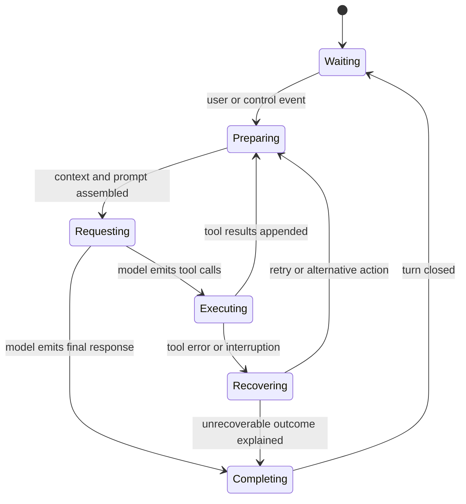

# Agent runtime foundations

## Why it matters

DeepSeek Harness can replace its model, tools, policies, and even Agent loop because the runtime separates model prediction from execution semantics. Understanding that separation is the prerequisite for every later module.

## Concrete anchor

An Agent is asked to diagnose two independent failing tests. It may read two files in parallel, receive one successful result and one error, decide whether the error is recoverable, edit only one file, run a targeted test, and then produce a final explanation. Each transition requires runtime state that the LLM alone does not own.

## Provisional mental model

Model the Agent loop as an observable state machine. A state contains consumable work and model-visible context; a transition is caused by a user event, model output, tool result, control event, or stopping rule.

This model makes the loop inspectable: every arrow needs an observable cause and a resulting state.

## Core concepts and mechanism

1. A caller writes user or control input into the Session instead of invoking an isolated “solve” function with hidden mutable state.
2. The Agent registry selects an Agent implementation and initiator scope, while the concrete `agent-loop` plugin interprets the work.
3. Runtime-context assembly resolves the model, system-prompt sections, prior Session events, available tools, permissions, and relevant policy state.
4. A semantic checkpoint can mark the boundary before a model request so recovery knows what work had been committed to the log.
5. The provider-neutral LLM seam streams assistant output and tool-call requests without granting those requests executable authority.
6. Tool-call handling validates names and arguments, then classifies every call by `executionMode`. Exclusive calls create barriers; later calls are reclassified before they start. Only dispatch and tool bodies may overlap, while post-processing and `tool/result` commits remain in model order.
7. Provider results and errors are converted into events. The loop then recomputes context from observable state rather than mutating a private transcript.
8. Completion occurs only after the loop determines there is no remaining consumable work or a control condition requires stopping.

> [!IMPORTANT]
> Repository structure confirms the separation between `agent.ts`, `runtime-context.ts`, and `tool-calls.ts`. The documented barrier rules constrain concurrency, but provider streaming, cancellation, and failure timing should still be validated with snapshots or traces when changing the loop.

The most damaging misconception is that “Agent” means a long prompt plus recursive API calls. That model hides permission, cancellation, error, concurrency, and persistence contracts.

## Refined mental model

The state-machine model accurately predicts that each decision must have an input state, trigger, and observable result. It becomes incomplete when it suggests one monolithic machine: plugins contribute the model, prompts, tools, policies, event listeners, persistence, and projections. A better operational rule is: **the Agent loop is a plugin that advances a scoped, event-backed runtime by interpreting model proposals and capability outcomes**.

## Optional hands-on

Try it yourself

Read `packages/core/agent-loop/src/agent.ts`, `runtime-context.ts`, and `tool-calls.ts`. For one path through the code, write down the starting event, the assembled dependencies, the emitted model or tool event, and the condition that schedules another step. Do not run a real API call unless you intentionally provide a test credential.

## Checkpoint questions

1. Why should a model tool call be treated as a proposal?

Show answer 1

Only the runtime can validate the tool schema, apply permissions and policies, choose a provider, execute the side effect, and record the outcome.

2. What does separating `runtime-context` from `tool-calls` make easier to reason about?

Show answer 2

It separates what the model can observe from how requested actions are validated and executed, reducing hidden coupling between prompt assembly and side effects.

3. A future provider streams two tool calls whose effects conflict. Which part of the refined model tells you where to solve it?

Show answer 3

Concurrency and conflict policy belong in the Tools execution pipeline or a policy wrapper, not in the model adapter or an unlogged side channel.

## Primary sources

- [Architecture: Agent turns and events](https://github.com/deepseek-ai/deepseek-harness/blob/99f6f02fecdb7dff40c3fbc9470f5907c29f74ca/docs/architecture.md)
- [Agent loop source](https://github.com/deepseek-ai/deepseek-harness/tree/99f6f02fecdb7dff40c3fbc9470f5907c29f74ca/packages/core/agent-loop/src)
- [Agent lifecycle and tool-call ordering](https://github.com/deepseek-ai/deepseek-harness/blob/99f6f02fecdb7dff40c3fbc9470f5907c29f74ca/docs/agent-lifecycle.md)
- [Testing policy](https://github.com/deepseek-ai/deepseek-harness/blob/99f6f02fecdb7dff40c3fbc9470f5907c29f74ca/docs/testing.md)

## Navigation

- [Deep track](README.md)
- Next: [Cordis plugin model](02-cordis-plugin-model.md)
- Related quick treatment: [Agent harness mental model](../quick/01-agent-harness-mental-model.md)
- [Topic root](../README.md)
