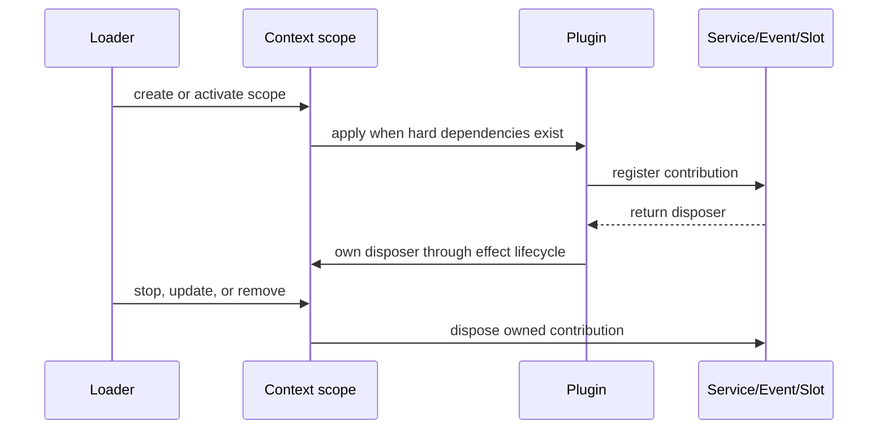

# Cordis plugin model

## Why it matters

Cordis supplies the service discovery, dependency handling, events, scopes, and effect disposal that make “Everything is a Plugin” an executable architecture rather than a packaging slogan.

## Concrete anchor

A plugin wants to display a clock in a Client Slot. It needs the `slots` capability, a timer, a React component, and cleanup when the plugin stops. Using a global timer or registering UI outside the plugin scope would leave work behind after an update.

## Provisional mental model

Treat a Cordis plugin as a scoped transaction over runtime registrations: dependencies determine when it can apply, `apply()` contributes effects, and disposal removes those contributions in reverse ownership order.

The sequence explains lifecycle ownership, not a database transaction: external side effects do not roll back automatically.

## Core concepts and mechanism

| Primitive | Runtime role | Correct use | Failure to avoid |
| --- | --- | --- | --- |
| `Context` | Scoped registry and event surface | Resolve stable capability keys | Treating it as unscoped global state |
| `inject` | Declares hard service dependencies | Use when the plugin must wait and reactivate | Adding it only to avoid an `undefined` check |
| `ctx.get(name)` | Reads an optional capability | Handle absence explicitly | Accessing undeclared `ctx.name` |
| `ctx.on()` | Registers an event listener | Respect the event's dispatch mode | Forgetting `next()` in a waterfall listener |
| `ctx.effect()` | Owns a subscription or disposer | Return cleanup for external registrations | Assuming arbitrary callbacks disappear automatically |
| Scope/Fiber | Binds contributions to lifecycle and isolation | Publish per-Session services in the intended realm | Accidentally creating a global service conflict |

1. The Loader resolves a composition and creates plugin scopes.
2. A plugin with hard injections remains waiting until the required services exist; an optional dependency is read with `ctx.get()` and handled locally.
3. `apply()` performs registration work. It must not return arbitrary UI or put process-wide side effects at module scope.
4. Services define callable seams, while typed events coordinate observations and interception. Event modes such as emit, waterfall, parallel, and serial change listener obligations.
5. Registries return disposers, and `ctx.effect()` owns subscriptions that are not already lifecycle-aware.
6. Stop, update, or removal disposes scope-owned contributions so a new package version can activate without duplicate listeners or services.
7. Isolation realms determine whether a service is process-level or Session-level; the wrong realm can make the second Session collide with the first.

> [!WARNING]
> Reversible registration is not a security sandbox. A plugin still runs with the capabilities and process authority it receives, and an external write needs its own compensation strategy.

## Refined mental model

The “scoped transaction” model predicts dependency waiting and cleanup, but it overpromises rollback. The accurate model is: **a plugin owns a set of runtime registrations whose lifetimes Cordis can reverse; it does not own or reverse every consequence produced through those registrations**. Use the model to reason about duplicate listeners, service conflicts, updates, and stale UI, not to infer security.

## Optional hands-on

Try it yourself

Inspect the timer example in `cordis-plugin-development/SKILL.md`. Rewrite the design in two variants: one with `inject: ['timer']` and one with optional `ctx.get('timer')`. State which behavior you want when the timer service is absent, then choose the matching variant.

## Checkpoint questions

1. Why might a hard-injected plugin disappear temporarily rather than fail permanently?

Show answer 1

Cordis can keep it waiting while a required service is absent and reactivate it when the dependency becomes available.

2. What must a waterfall listener do when it is not intentionally terminating the chain?

Show answer 2

It must call and return `next()` so downstream listeners can continue processing.

3. A plugin update leaves two active external subscriptions. What does the refined model suggest checking first?

Show answer 3

Check whether each subscription returned a disposer and whether that disposer was owned through the Cordis effect lifecycle.

## Primary sources

- [Cordis primer](https://github.com/deepseek-ai/deepseek-harness/blob/99f6f02fecdb7dff40c3fbc9470f5907c29f74ca/docs/cordis-primer.md)
- [Dynamic Cordis plugin Skill](https://github.com/deepseek-ai/deepseek-harness/blob/99f6f02fecdb7dff40c3fbc9470f5907c29f74ca/apps/cli/config/agent-presets/cordis/skills/cordis-plugin-development/SKILL.md)
- [Repository conventions](https://github.com/deepseek-ai/deepseek-harness/blob/99f6f02fecdb7dff40c3fbc9470f5907c29f74ca/AGENTS.md)

## Navigation

- Prerequisite: [Agent runtime foundations](01-agent-runtime-foundations.md)
- [Deep track](README.md)
- Next: [Profiles, bundles, presets, and planes](03-profiles-bundles-presets.md)
- Related quick treatment: [Everything is a Plugin](../quick/02-everything-is-a-plugin.md)
- [Topic root](../README.md)
