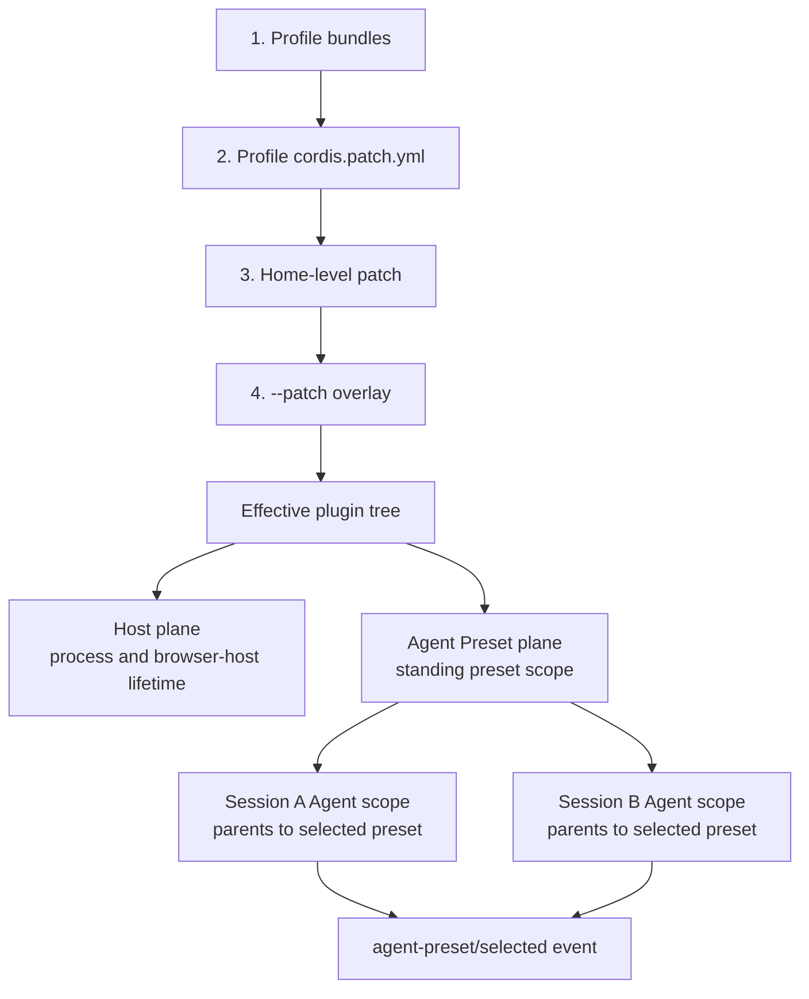

# Profiles, bundles, presets, and planes

## Why it matters

DeepSeek Harness behavior is determined by the effective plugin tree, not by a single configuration file. Host facilities and preset-selected Agent capabilities also belong to different composition planes.

## Concrete anchor

Two browser sessions choose different Agent presets. Both need the same Web server and ApiProxy, while each Session joins the standing scope of its selected preset. If a shared preset plugin stores mutable state without a Session key, one Session can leak state into another even though their Agent scopes are distinct.

## Provisional mental model

Use two axes at once: an ordered stack determines which plugins are mounted, while an ownership plane determines how long each mounted capability should live. A preset is a standing process-level mount that multiple Session Agent scopes can join; it is not physically remounted for every Session.

Read downward for precedence and sideways for ownership. A later patch changes the effective tree; it does not change which plane should own a capability.

## Core concepts and mechanism

| Concept | Owns or expresses | Typical contents | Critical rule |
| --- | --- | --- | --- |
| Bundle | Reusable installable composition layer | Base, headless, or Web packages | A composition root has high fan-out by design |
| Profile | Runnable ordered composition | Bundles plus profile patch | Inspect the effective tree, not only the source patch |
| Patch | Replacement or overlay entries | Provider selection and configuration | Base patch semantics are not a universal deep merge |
| Host plane | Process or browser-host facilities | HTTP, WebSocket, static files, ApiProxy, directory picker, plugin inventory | Do not reproduce Host services per Session |
| Agent Preset plane | One standing mount shared by Sessions that select it | Model, tools, prompt, permissions, compaction, subagents | Key mutable state by Session; do not assume one physical preset mount per Session |

1. A runnable command selects a profile such as Web or headless.
2. The profile loads reusable bundles, then its own patch, then a home-level patch, then any temporary `--patch` overlay.
3. Later layers can replace earlier entries, so source inspection must be paired with the effective configuration produced by the Loader.
4. The Host plane mounts facilities whose lifetime spans sessions, including the Web server, remote API, static site, and plugin inventory.
5. Agent preset discovery mounts each preset directory once per process under a standing scope containing the model, tools, prompt sections, permission policies, compaction, and subagent capabilities.
6. A Session selects a preset by parenting its Agent scope to that standing preset scope. Shared preset registrations are therefore normal; plugins that keep mutable state must key it by Session or another explicit owner.
7. Switching a blank Session commits an `agent-preset/selected` event. The creation header remains frozen, so reconstruction must resolve the preset the Session runs rather than assuming it still runs the preset it started with.
8. Built-in presets are templates rather than user-editable state; copy and modify a preset instead of editing the built-in definition in place.

The common misconception is that “Web profile” and “Agent preset” are alternative names for the same configuration level. One selects product hosting; the other is a standing capability composition that Session Agent scopes join.

## Refined mental model

The two-axis model predicts both precedence and lifetime. Its limit is that a package can contribute to more than one surface, a dynamic plugin may have Host and Client halves, and a Session can switch its selected preset without rewriting its creation header. The stable question is: **which composition selected this plugin, which standing scope mounted it, and how is mutable state keyed so concurrent Sessions do not conflict?**

## Optional hands-on

Try it yourself

Run or inspect the CLI's configuration dump for a profile, then trace one effective plugin entry back through bundle, profile, home, and command-line layers. Separately classify the plugin as Host-plane or Agent-Preset-plane work, explain its standing lifetime, and identify how any mutable state should be keyed for multiple Sessions.

## Checkpoint questions

1. Why can reading only `packages/bundle/base/cordis.patch.yml` misdescribe a running profile?

Show answer 1

Profile, home, and command-line layers can override or replace entries, so the Loader's effective plugin tree is the runtime evidence.

2. Where should a browser static-file server live?

Show answer 2

In the Host plane because it serves the process or product surface and should not be duplicated for each Agent Session.

3. Two Sessions use the same preset and one sees the other's mutable state. What should you inspect?

Show answer 3

Inspect whether the preset plugin stores mutable state in its standing shared scope without a Session key. The preset is mounted once per process, so Session isolation must come from scope-aware access or explicit per-Session state.

## Primary sources

- [Architecture: profiles and bundles](https://github.com/deepseek-ai/deepseek-harness/blob/99f6f02fecdb7dff40c3fbc9470f5907c29f74ca/docs/architecture.md)
- [Editing Cordis compositions Skill](https://github.com/deepseek-ai/deepseek-harness/blob/99f6f02fecdb7dff40c3fbc9470f5907c29f74ca/apps/cli/config/agent-presets/cordis/skills/editing-cordis-compositions/SKILL.md)
- [Agent preset lifecycle and switching](https://github.com/deepseek-ai/deepseek-harness/blob/99f6f02fecdb7dff40c3fbc9470f5907c29f74ca/packages/preset/agent-presets/README.md)

## Navigation

- Prerequisite: [Cordis plugin model](02-cordis-plugin-model.md)
- [Deep track](README.md)
- Next: [Agent loop and Session events](04-agent-loop-and-session-events.md)
- Related quick treatment: [Everything is a Plugin](../quick/02-everything-is-a-plugin.md)
- [Topic root](../README.md)
