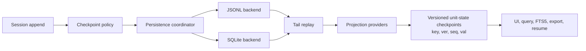

# Agent loop and Session events

## Why it matters

The Session event stream is the shared contract among the Agent loop, persistence, projections, Web UI, search, resume, fork, SDKs, and user-visible state such as goals or todos.

## Concrete anchor

An Agent edits a file after receiving an approval and then the process crashes before the UI shows completion. Recovery must determine which user input, approval, model response, tool call, tool result, and checkpoint are durable, then rebuild a current view without inventing progress.

## Provisional mental model

Use a source-and-projection model: events are immutable observations about what happened; projections are rebuildable answers to current-state questions.

The cache accelerates a view; it does not replace the event stream's authority.

## Core concepts and mechanism

| Event or state category | Lifetime | Typical consumer | Key invariant |
| --- | --- | --- | --- |
| Durable Session event | Persisted with the Session | Resume, fork, projections, SDK output | Required model-visible history must be reconstructable |
| Live Agent event | Runtime observation during execution | Streaming UI and immediate control | Live delivery does not make it the durable source |
| Capability event | Typed coordination or policy interception | Plugins and wrappers | Dispatch mode determines listener obligations |
| Projection | Derived current-state view | UI, search, goals, todos, titles | Rebuildable from persisted state and tail replay |
| Projection checkpoint row | Versioned cached unit state | Cold reads and incremental replay | Stores fold state, not a rendered UI view |
| Checkpoint | Semantic progress marker | Recovery and persistence policy | Marks progress without deleting causal history |

1. User, control, and model-visible inputs append to the Session.
2. The Agent loop reads relevant work and assembles context from services and prior events.
3. Model chunks, assistant messages, tool calls, tool results, errors, approvals, and control outcomes add observable facts. `request/header` records the next-request header, while `request/context` records route or context-window metadata needed to reconstruct request behavior.
4. A checkpoint policy records a semantic boundary suitable for recovery.
5. The persistence coordinator prepares a revision and writes through the configured backend.
6. Projection providers derive domain views. The cache persists versioned unit-state checkpoint rows such as `(key, ver, seq, val)`, not already rendered Conversation or UI views.
7. On a cold read, the registry restores or re-views that unit state, combines it with the persistence tail, and replays missing events to produce the current projection.
8. Query, FTS5 search, export, Web UI, and SDK surfaces consume the same Session semantics instead of maintaining separate histories.

> [!NOTE]
> The package layout and documentation establish this design. Crash recovery, backpressure, and exact streamed-event interleaving are operational properties that require runtime tests rather than static inference.

The most likely misconception is to call an append-only log a complete audit system. The repository does not thereby guarantee tamper evidence, retention policy, legal hold, or centralized enterprise export.

## Refined mental model

The source-and-projection model explains replay and view rebuilding. Its limit is operational: persistence can lag, caches can be stale, and event schemas can change during a developer preview. The reliable model is: **the Session stream is the semantic source of model-visible work, while persistence and projections implement recoverable materializations with explicit revision and compatibility contracts**.

## Optional hands-on

Try it yourself

Create a hypothetical event sequence for a user request, `request/header`, `request/context`, approval, file edit, test result, and final response. Derive a conversation projection and a “current task status” projection from the same events. Then checkpoint one projection's unit state, add a late tool-result event, and replay the tail.

## Checkpoint questions

1. Why can two projections disagree temporarily without creating two sources of truth?

Show answer 1

They may be at different replay revisions or cache states, but both must ultimately derive from the same durable event stream.

2. What does “Model-visible means logged” prevent?

Show answer 2

It prevents hidden context from influencing a model request in a way that resume, fork, replay, debugging, or SDK consumers cannot reconstruct.

3. An enterprise needs proof that logs were never altered. Does append-only Session design alone satisfy that requirement?

Show answer 3

No. It needs additional integrity controls such as signed or WORM storage, access control, retention policy, and independently verifiable audit export.

## Primary sources

- [Architecture: Session log and events](https://github.com/deepseek-ai/deepseek-harness/blob/99f6f02fecdb7dff40c3fbc9470f5907c29f74ca/docs/architecture.md)
- [Session persistence coordinator](https://github.com/deepseek-ai/deepseek-harness/tree/99f6f02fecdb7dff40c3fbc9470f5907c29f74ca/packages/session/session-persistence/src)
- [Session request events](https://github.com/deepseek-ai/deepseek-harness/blob/99f6f02fecdb7dff40c3fbc9470f5907c29f74ca/docs/subsystems/session.md)
- [Session projection registry](https://github.com/deepseek-ai/deepseek-harness/blob/99f6f02fecdb7dff40c3fbc9470f5907c29f74ca/packages/session/session-projection/README.md)
- [Projection checkpoint cache](https://github.com/deepseek-ai/deepseek-harness/blob/99f6f02fecdb7dff40c3fbc9470f5907c29f74ca/packages/session/session-projection-cache/README.md)
- [ApiProxy model-selection semantics](https://github.com/deepseek-ai/deepseek-harness/blob/99f6f02fecdb7dff40c3fbc9470f5907c29f74ca/packages/host/apiproxy/README.md)

## Navigation

- Prerequisite: [Profiles, bundles, presets, and planes](03-profiles-bundles-presets.md)
- [Deep track](README.md)
- Next: [Capability seams](05-capability-seams.md)
- Related quick treatment: [Session-driven runtime](../quick/03-session-driven-runtime.md)
- [Topic root](../README.md)
