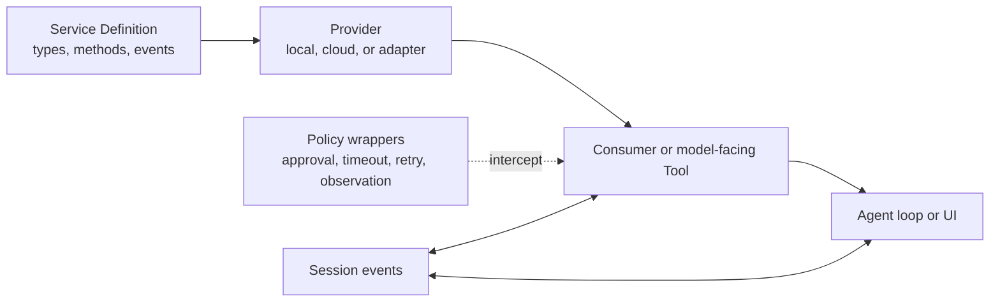

# Capability seams

## Why it matters

Capability seams let the Agent loop depend on stable behavior while profiles choose concrete providers and policies. This is the mechanism behind model, filesystem, shell, sandbox, subagent, workflow, Web, LSP, and MCP replaceability.

## Concrete anchor

An enterprise wants the same `web` tool to use an approved internal search endpoint instead of the default provider. Editing the tool, Agent loop, and UI would create a fork. Providing the existing Web service seam keeps the consumer stable while the profile changes the implementation.

## Provisional mental model

Use a four-stage pipeline: a Service Definition establishes the contract, a Provider implements it, a Consumer or Tool exposes it to a caller, and Policy wrappers constrain execution without changing the service API.

The Session arrows matter because a model-visible capability outcome must become reconstructable runtime state.

## Core concepts and mechanism

| Capability | Seam | Example providers | Consumer or policy surface |
| --- | --- | --- | --- |
| LLM | `llm` | DeepSeek and `pi-ai` adapters | Model selection, retry, token meter |
| Filesystem I/O | `fs` | Local, sandbox, E2B | `tool-fs` and observation policy |
| Code search | `subprocess`, not `fs` | Packaged `ripgrep` process | `tool-fs-search`; changing `ctx.fs` does not redefine grep/glob semantics |
| Shell/process | `shell`, `subprocess`, `terminal` | Local, PowerShell, PTY, sandbox, E2B | Bash/PowerShell tools, timeout policy |
| Sandbox | `sandbox` | Linux, macOS, Windows local backends | Mode and workspace policy |
| Subagent | Named multi-provider registry | In-process, ACP, SDK, Claude, Codex can coexist | Delegation, provider selection, control, continuation, reporting |
| Workflow | `workflow` | Worker-thread engine | Workflow and Ralph tools |
| Web/LSP/MCP | `web`, `lsp`, bridge services | Search/fetch providers and stdio servers | `tool-web`, `tool-lsp`, registered MCP tools |

1. The Service Definition owns the stable callable contract and typed events.
2. A Provider resolves deployment-specific choices such as local versus remote execution or one model endpoint versus another.
3. A Consumer translates the service into the interface required by the Agent loop, a model-facing Tool, the Web UI, or another service.
4. Profiles and presets choose which Provider and Consumer plugins are mounted; the Agent loop does not import every concrete implementation.
5. Wrappers and event gates add timeout, retry, approval, read-before-edit, spill, or observation behavior without growing the Provider API.
6. Tool execution remains the authority for side effects. Presentation code must be a pure view of arguments and outcomes.
7. Capability events and results that influence the model are written into the Session so the next request and later replay see the same evidence.
8. Not every capability is a one-provider swap. Subagent is intentionally a registry of multiple named providers, while filesystem search bypasses `ctx.fs` and spawns packaged `ripgrep` through `ctx.subprocess`.

> [!IMPORTANT]
> A capability seam is complete only when Definition, Provider, and Consumer roles exist. A package that registers a tool but silently embeds its own provider makes replacement and policy composition harder.

> [!NOTE]
> The three-role model describes the dependency direction, not the required provider cardinality. A registry seam may host multiple providers simultaneously, and a nearby Tool may use a different lower-level seam than its package name suggests.

The likely misconception is that every provider is equivalent because it satisfies the same TypeScript interface. Latency, isolation, error contracts, credential handling, and supported semantics still differ and must be part of the Provider contract or policy.

## Refined mental model

The pipeline model accurately shows dependency inversion and policy composition. It stops being reliable if it suggests a strictly linear call: events, streaming, cancellation, concurrency, and projections create additional paths. The durable rule is: **consumers depend on a capability contract, composition chooses the provider, policies wrap execution, and every model-relevant outcome rejoins the Session state**.

## Optional hands-on

Try it yourself

Trace both a file read and a code search. Locate the `fs` Service Definition, one filesystem provider, `tool-fs`, the observation policy, `tool-fs-search`, and its `subprocess` dependency. Explain why replacing `ctx.fs` changes the read path but not automatically the search implementation.

## Checkpoint questions

1. Why should retry behavior usually be a wrapper rather than a method added to every provider?

Show answer 1

Retry is a cross-cutting execution policy. A wrapper can apply it consistently without expanding each provider's capability contract or duplicating logic.

2. Why does replacing the `fs` provider not automatically replace code-search behavior?

Show answer 2

`tool-fs-search` uses packaged `ripgrep` through `ctx.subprocess` rather than calling `ctx.fs` methods, so the two Tools cross different lower-level seams.

3. A replacement provider returns a new error category that the Tool never logs. Which invariants are at risk?

Show answer 3

The consumer contract may drift, policy may mis-handle the error, and later model requests or replay cannot reconstruct the actual capability outcome.

## Primary sources

- [Architecture: capability seams](https://github.com/deepseek-ai/deepseek-harness/blob/99f6f02fecdb7dff40c3fbc9470f5907c29f74ca/docs/architecture.md)
- [Repository capability convention](https://github.com/deepseek-ai/deepseek-harness/blob/99f6f02fecdb7dff40c3fbc9470f5907c29f74ca/AGENTS.md)
- [Filesystem subsystem boundaries](https://github.com/deepseek-ai/deepseek-harness/blob/99f6f02fecdb7dff40c3fbc9470f5907c29f74ca/docs/subsystems/filesystem.md)
- [Filesystem package map](https://github.com/deepseek-ai/deepseek-harness/blob/99f6f02fecdb7dff40c3fbc9470f5907c29f74ca/packages/fs/README.md)
- [Subagent subsystem](https://github.com/deepseek-ai/deepseek-harness/blob/99f6f02fecdb7dff40c3fbc9470f5907c29f74ca/docs/subsystems/subagent.md)
- [Subagent provider registry](https://github.com/deepseek-ai/deepseek-harness/blob/99f6f02fecdb7dff40c3fbc9470f5907c29f74ca/packages/subagent/README.md)

## Navigation

- Prerequisite: [Agent loop and Session events](04-agent-loop-and-session-events.md)
- [Deep track](README.md)
- Next: [Interfaces and Typert](06-interfaces-and-typert.md)
- [Topic root](../README.md)
