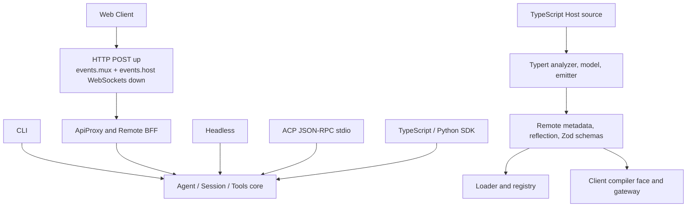

# Interfaces and Typert

## Why it matters

DeepSeek Harness exposes one runtime through CLI, Web, headless, ACP, and TypeScript/Python SDKs. The Web surface adds a remote contract whose Host and Client compiler faces must stay synchronized.

## Concrete anchor

The browser requests Session data through HTTP and receives live events through two downlink-only WebSockets, one for `events.mux` and one for `events.host`. If the Host changes an RPC payload while the Client still compiles against an independently written type, the UI can fail only after deployment.

## Provisional mental model

Use two connected pipelines: runtime entry points converge on one Agent/Session core, while Typert moves TypeScript contract extraction into the Host build before the Client consumes it.

The first half explains runtime reuse; the second explains how the cross-process contract is produced.

## Core concepts and mechanism

| Entry or component | Transport | Main use | Important boundary |
| --- | --- | --- | --- |
| CLI | Local process command | Interactive or profile-selected product entry | Widest package composition |
| Web | HTTP POST plus two downlink-only WebSockets | Browser product surface | `events.mux` and `events.host` have separate readiness and reconnect paths |
| Headless | Direct process startup | One-shot automation | No Host, HTTP, or browser |
| ACP | Newline-delimited JSON-RPC over stdio | Agent automation and external clients | Independent of Web transport |
| TypeScript SDK | Out-of-process runtime supplied by the caller | Programmatic Harness control | Caller supplies the executable and `cordis.yml` |
| Python SDK | Subprocess with bundled runtime by default; newline-delimited JSON-RPC | Python automation | Transport and packaging differ from the TypeScript SDK |
| Typert generator | Build-time TypeScript analysis | Produce compiler-independent contract metadata | Host build must establish contracts before Client typecheck |

1. CLI startup selects a profile and boots the Loader; Web and headless are compositions of the same core services rather than independent Agent implementations.
2. The browser's connection package keeps unary and respond operations on HTTP POST, then opens separate downlink-only WebSockets for `events.mux` and `events.host`.
3. ApiProxy and Remote BFF map typed schema and RPC methods onto Agent, Session, Tools, settings, goals, jobs, approvals, and other core services.
4. ACP and SDK paths expose automation without requiring the browser UI. Both SDK families drive an out-of-process runtime, but the TypeScript caller supplies that runtime while Python defaults to a bundled subprocess transport.
5. Host and Client packages both extend Cordis `Context`, so the repository uses separate TypeScript aggregate programs instead of forcing both faces into one `ts.Program`.
6. The Host build runs Typert analysis, converts compiler-specific information into a compiler-independent model, and emits package contributions, Remote metadata, reflection, and Zod schemas.
7. Loader, registry, gateway, remotes, and Client builds consume those generated contracts, reducing duplicate handwritten payload definitions.
8. Build order therefore becomes part of correctness: Host contracts must be ready before Client typechecking and bundling.

> [!NOTE]
> Static structure confirms the generator components and build order. The exact generated production file set and incremental rebuild behavior should be observed in a real build rather than inferred from package names.

The common misconception is that generated types eliminate runtime trust boundaries. Zod schemas and Remote metadata help at process or wire boundaries, but authentication, authorization, origin policy, and transport security are separate responsibilities.

## Refined mental model

The dual-pipeline model predicts why many entry points can share behavior and why the build has two compiler faces. Its limit is that transport reliability, reconnect, backpressure, and access control are runtime concerns. The operational model is: **one event-backed core serves multiple adapters, while Typert freezes cross-face structure at build time without replacing security or delivery guarantees**.

## Optional hands-on

Try it yourself

Trace one Session query from a Client schema through ApiProxy or Remote BFF to a core service. Then inspect the root `build:lib:host` and `build:lib:client` scripts and explain why reversing their order would leave the Client without established contracts.

## Checkpoint questions

1. Why is the Web application not a second Agent implementation?

Show answer 1

It is a Host/Client surface that calls and projects the same Agent, Session, Tools, persistence, and capability services used by other entry points.

2. Why are Host and Client compiled as separate aggregate programs?

Show answer 2

Both extend Cordis `Context` for different runtime faces, so combining them into one program would conflate incompatible declarations and contract-generation phases.

3. Typert generates a valid RPC schema, but an unauthenticated network client can reach the endpoint. What did Typert not solve?

Show answer 3

It did not solve authentication, authorization, TLS, origin policy, or network exposure; it solved structural contract generation and validation.

## Primary sources

- [Development guide: TypeScript project layout](https://github.com/deepseek-ai/deepseek-harness/blob/99f6f02fecdb7dff40c3fbc9470f5907c29f74ca/docs/development.md)
- [Typert subsystem](https://github.com/deepseek-ai/deepseek-harness/blob/99f6f02fecdb7dff40c3fbc9470f5907c29f74ca/docs/subsystems/typert.md)
- [Client connection package](https://github.com/deepseek-ai/deepseek-harness/tree/99f6f02fecdb7dff40c3fbc9470f5907c29f74ca/packages/client/connection)
- [ApiProxy package](https://github.com/deepseek-ai/deepseek-harness/tree/99f6f02fecdb7dff40c3fbc9470f5907c29f74ca/packages/host/apiproxy)
- [TypeScript SDK runtime boundary](https://github.com/deepseek-ai/deepseek-harness/blob/99f6f02fecdb7dff40c3fbc9470f5907c29f74ca/packages/sdk/README.md)
- [Python SDK subprocess boundary](https://github.com/deepseek-ai/deepseek-harness/blob/99f6f02fecdb7dff40c3fbc9470f5907c29f74ca/python/README.md)
- [Root build scripts](https://github.com/deepseek-ai/deepseek-harness/blob/99f6f02fecdb7dff40c3fbc9470f5907c29f74ca/package.json)

## Navigation

- Prerequisite: [Capability seams](05-capability-seams.md)
- [Deep track](README.md)
- Next: [Plugin development workflow](07-plugin-development-workflow.md)
- [Topic root](../README.md)
