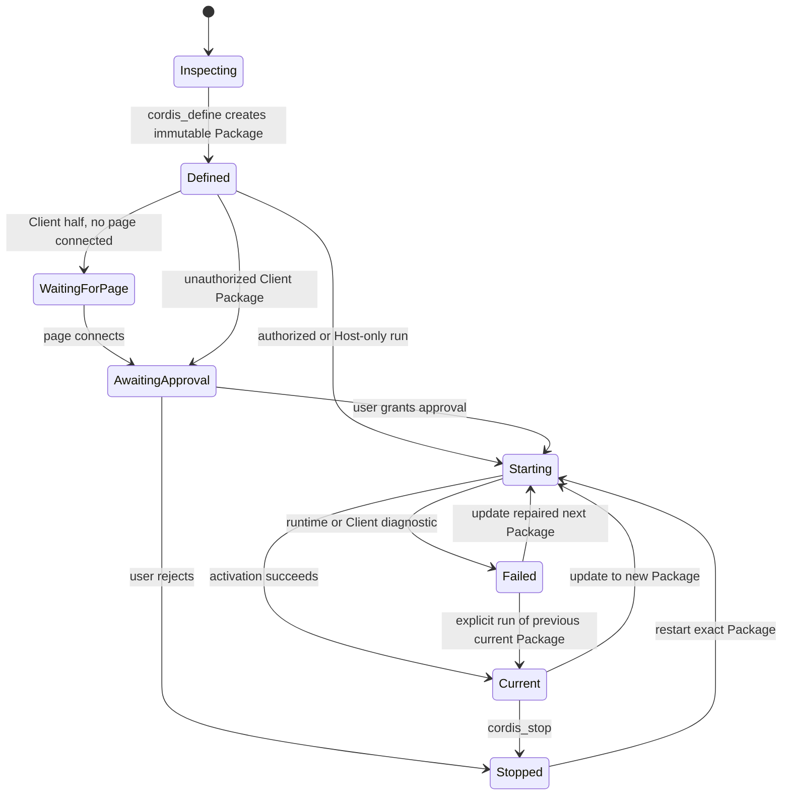

# Plugin development workflow

## Why it matters

Dynamic Cordis plugins can add Host services, model Tools, Client UI, and package-private Host calls, but they run against a live capability directory. The repository Skill therefore requires inspection before implementation and immutable versions for repair.

## Concrete anchor

Build a plugin that searches an internal code index on the Host and displays the result in a Client Slot. The Host needs a real search service, the Client needs a live Slot contract, and both halves must exchange only lossless JSON.

## Provisional mental model

Treat plugin development as an inspectable release state machine. A stable Plugin identity owns immutable Package versions, while every activation attempt has a separate Run identity.

The state machine explains why defining code does not execute it and why failed updates do not silently rewrite history.

## Core concepts and mechanism

| Situation | Required action | Why |
| --- | --- | --- |
| Discover capabilities | `cordis_inspect_list`, then minimal `cordis_inspect_query` calls | Names and examples do not prove the current interface or mount state |
| Create first version | `cordis_define` with a new Plugin and Package | Definition is reviewable and immutable |
| Start or restart same version | `cordis_run` with mode `run` | No implicit version switch |
| Switch to a different Package | `cordis_run` with mode `update` | Preserves current/next semantics |
| Diagnose a failure | `cordis_inspect_self(pluginId, packageId)` | Reads exact source and Run-specific diagnostics |
| Repair | Define another Package under the same Plugin, then `update` | Never overwrite a failed immutable Package |
| Roll back | Explicitly `run` the `currentPackageId` | A failed update does not restore the old physical Run automatically |
| Pause or delete | `cordis_stop` or `cordis_undefine` | Stop preserves versions; undefine removes them permanently |

1. Decide whether the data owner is Host or Client. Files, processes, agents, and durable Session data belong on Host; page layout, theme, live Slot props, and browser interaction belong on Client.
2. List current Inspect Providers and query only the exact Services, Events, Builtins, Slots, Theme tokens, or Tools the plugin will use.
3. Write plain JavaScript function bodies. Dynamic code is not compiled with TypeScript, JSX, imports, or a bundler; Client React uses `React.createElement`.
4. Register lifecycle work inside `apply()` and retain disposers. Query optional services with `ctx.get()`; declare only true hard dependencies with `inject`.
5. For Host-to-Client behavior, register a package-private handler with `harness.handle` and call it with `host.call`. Arguments and results must be lossless JSON and must not contain Contexts, services, React elements, or live snapshots.
6. Define an immutable Package, then activate the exact `pluginId` and `packageId` with the correct run or update mode.
7. A Package with a Client half needs a connected page to complete the page-mediated round trip. Without one, the Run can remain suspended before approval or Client activation.
8. Treat `awaiting-approval` and `starting` as intermediate states, not success. A Run that already answered `ok` can still produce a later render failure; that diagnostic does not retroactively rewrite the Run outcome.
9. Use Run-specific diagnostics to repair parse, dependency, Slot, rendering, or Host-call failures. Stop to preserve rollback options; undefine only when the Plugin and all Package history are no longer needed.

> [!CAUTION]
> Do not retry automatically after a user rejects approval. Rejection is a decision, not a transient technical failure.

> [!WARNING]
> `run ok` proves that activation settled, not that every future Client render will succeed. Keep post-settle render diagnostics visible and verify that an appropriate page remains connected.

The likely misconception is to infer a complete API from a service name or example. The capability directory is dynamic, and the current page may not expose the Client Slot a previous example used.

## Refined mental model

The release-state model predicts version, approval, repair, and rollback behavior. Its limits are process and page lifetime: dynamic plugins are process-local, a Client half depends on a connected page, and rendering can fail after activation settled. The operational rule is: **inspect the live contract, define an immutable Package, activate an exact version, monitor both Run and render diagnostics, and repair by appending versions rather than mutating history**.

## Optional hands-on

Try it yourself

Design the internal code-search plugin without executing it. List the Host Service query, Client Slot query, JSON request and response fields, lifecycle disposers, initial `run` mode, update mode, and explicit rollback step. Reject any design that sends a full Session or Conversation Snapshot across the private RPC.

## Checkpoint questions

1. Why must `cordis_inspect_query` precede code generation?

Show answer 1

The current runtime determines exact method signatures, event modes, Slot protocols, props, tokens, and mounted capabilities; names and old examples are insufficient.

2. An update fails after a new Package becomes `nextPackageId`. How do you repair without losing rollback?

Show answer 2

Inspect the failed Package, define another immutable Package under the same Plugin, and update to it. Keep the successful `currentPackageId` available for an explicit rollback run.

3. A Run reports `ok`, but the Client contribution never appears. What should you inspect before redefining the Package?

Show answer 3

Inspect whether a matching page is connected and check post-settle render diagnostics. Activation success does not prove that a later render succeeded, so redefining the Package before reading those diagnostics can hide the actual failure.

## Primary sources

- [Dynamic Cordis plugin Skill](https://github.com/deepseek-ai/deepseek-harness/blob/99f6f02fecdb7dff40c3fbc9470f5907c29f74ca/apps/cli/config/agent-presets/cordis/skills/cordis-plugin-development/SKILL.md)
- [Dynamic Host runner lifecycle](https://github.com/deepseek-ai/deepseek-harness/blob/99f6f02fecdb7dff40c3fbc9470f5907c29f74ca/packages/extensions/cordis-host-runner/README.md)
- [Dynamic Client runner](https://github.com/deepseek-ai/deepseek-harness/tree/99f6f02fecdb7dff40c3fbc9470f5907c29f74ca/packages/extensions/cordis-client-runner)

## Navigation

- Prerequisite: [Interfaces and Typert](06-interfaces-and-typert.md)
- [Deep track](README.md)
- Next: [Security and enterprise readiness](08-security-and-enterprise-readiness.md)
- [Topic root](../README.md)
