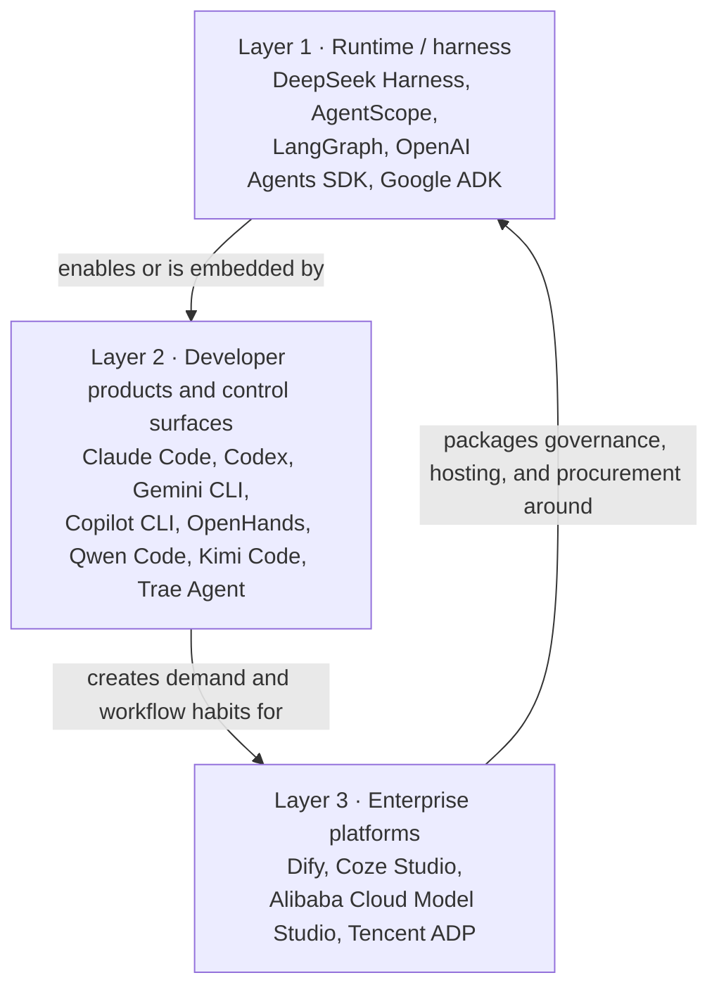

# Global and China competition

## Why it matters

“Agent” names products at different layers. Comparing a runtime, a coding application, and an enterprise platform in one leaderboard hides the actual buyer, switching cost, and route to revenue.

## Concrete anchor

AgentScope, Qwen Code, Dify, and Alibaba Cloud Model Studio can all appear in a search for “Agent platform,” but one supplies an execution foundation, another a developer product, and the others enterprise application and procurement surfaces.

## Provisional mental model

Segment the market into three interacting layers, then compare products only within a layer before analyzing cross-layer substitution.

The arrows are not ownership claims. They show how capabilities, user habits, and enterprise controls can travel across layers.

## Core concepts and mechanism

**Public repository snapshot: 2026-08-18. Stars and forks measure public attention, not active users, revenue, production SLA, or market share.**

| Layer | Product | Verifiable positioning | Relative lesson for Harness |
| --- | --- | --- | --- |
| 1 | DeepSeek Harness | MIT; `157,324` stars and `16,338` forks; developer preview, “everything is a plugin,” one current RC tag | Strong architecture attention; early enterprise control plane |
| 1 | AgentScope 2.0 | Apache-2.0; `29,019` stars and `3,369` forks; multi-tenant/session service deployment, HITL, tool review, sandbox | Closest China runtime peer with more explicit service primitives |
| 1 | LangGraph / OpenAI Agents SDK / Google ADK / Microsoft Agent Framework | Stateful orchestration; provider-agnostic workflows; code-first build/evaluate/deploy; production-grade Agents, Harness Agent, and Workflows | Compete for runtime contracts, evaluation, integrations, and vendor ecosystems |
| 2 | Qwen Code | Apache-2.0; `27,144` stars and `2,877` forks; terminal, headless, IDE, desktop, daemon, SDK, China messaging entry points | Stronger finished coding workflow and domestic distribution |
| 2 | Kimi Code | MIT; `6,882` stars and `1,076` forks; single-file distribution, MCP, subagents, hooks, ACP | Lightweight developer experience; narrower runtime/control ambition |
| 2 | Trae Agent | MIT; `12,030` stars and `1,340` forks; multi-model, MCP, trajectories, Docker | Research transparency and modifiability; public repo cadence is one signal only |
| 2 | OpenHands Agent Canvas | MIT; `84,384` stars and `10,966` forks; self-hosted developer control center for coding agents across local, remote, and cloud backends | Competes on coding-agent operations and automation surfaces, not core runtime architecture |
| 3 | Dify | Dify Open Source License; `152,784` stars and `24,135` forks; workflows, RAG, Agent, LLMOps, cloud and self-hosting | Competes for application-builder and enterprise platform budget |
| 3 | Coze Studio | Apache-2.0; `21,460` stars and `3,120` forks; visual Agent, workflow, RAG, plugins, self-hosting; some features are commercial-only | Low-code and ByteDance ecosystem distribution; deployment security remains operator work |
| 3 | Alibaba Cloud Model Studio | Managed models, MCP, Skills, knowledge, data connectors, sandbox, secure VPC storage | Cloud account, model distribution, governance, billing, and support |
| 3 | Tencent ADP | Licensed deployment into a customer's Tencent Cloud IaaS/VPC; enterprise/workspace permissions and isolation | Strong procurement surface; not an open-source harness replacement |

1. Runtime projects build switching cost through model, Tool, state, sandbox, and plugin contracts.
2. Developer products win habits through installation, UX, IDE and terminal integration, collaboration channels, and task completion quality.
3. Enterprise platforms capture budgets through IAM, VPC, knowledge and data connectors, billing, deployment, service levels, and implementation partners.
4. Open-source attention accelerates experimentation, contribution, and hiring, but revenue usually attaches to managed control planes, hosting, support, and enterprise guarantees.
5. DeepSeek Harness can therefore lead architectural discussion while depending on a cloud, product, or integration partner to convert attention into enterprise contracts.
6. A competitor in one layer can also embed Harness or expose compatible capabilities, so the relationship may be competitive, complementary, or both.

The closest comparison depends on the decision:

- **Architecture:** AgentScope, LangGraph, OpenAI Agents SDK, Google ADK, and Microsoft Agent Framework.
- **Daily coding workflow and control surface:** Qwen Code, Claude Code, Codex, Gemini CLI, Copilot CLI, OpenHands Agent Canvas, Kimi Code, and Trae Agent.
- **Enterprise application budget:** Dify, Coze Studio, Alibaba Cloud Model Studio, and Tencent ADP.

> [!IMPORTANT]
> Alibaba Cloud offering DeepSeek models does not prove that it distributes DeepSeek Harness. Model availability and harness integration are different claims.

The limits are material: repository age differs; product categories differ; commercial tools do not expose comparable public usage data; vendor architecture and sovereignty claims are not independent audits; and the available evidence does not support revenue or market-share rankings.

## Refined mental model

The three-layer map avoids false peer comparisons and explains where adoption becomes revenue. Its limit is that products can span layers over time. The robust method is: **identify the buyer and job, compare within the same layer, then inspect which adjacent-layer control or distribution advantage can change the outcome**.

## Optional hands-on

Try it yourself

Choose one decision—building an internal Agent runtime, equipping 500 developers, or deploying a governed knowledge application. Create a shortlist only after naming the buyer, required control plane, hosting boundary, switching cost, and procurement path. Explain why at least two products in the table should be excluded.

## Checkpoint questions

1. Who is the closest DeepSeek Harness competitor?

Show answer 1

The question needs a layer. AgentScope is a close China runtime comparison; Qwen Code is a direct developer-workflow substitute; Tencent ADP, Model Studio, Dify, and Coze compete more directly for enterprise application budgets.

2. Why can Qwen Code win developers with fewer stars than Harness?

Show answer 2

Developers adopt a completed workflow. Installation, IDE and daemon surfaces, SDKs, local model support, and China messaging distribution can matter more than runtime composability.

3. Why must cloud platforms appear in the competitive map?

Show answer 3

Enterprises buy governed production systems. Cloud accounts, identity, VPC, billing, operations, and support can convert technical interest into a contract even when the underlying runtime is less open.

## Primary sources

- [DeepSeek Harness repository metadata](https://api.github.com/repos/deepseek-ai/deepseek-harness), retrieved 2026-08-18.
- [AgentScope repository and positioning](https://github.com/agentscope-ai/agentscope), retrieved 2026-08-18.
- [Qwen Code repository and interfaces](https://github.com/QwenLM/qwen-code), retrieved 2026-08-18.
- [Kimi Code repository](https://github.com/MoonshotAI/kimi-code), retrieved 2026-08-18.
- [Trae Agent repository](https://github.com/bytedance/trae-agent), retrieved 2026-08-18.
- [OpenHands Agent Canvas](https://github.com/OpenHands/OpenHands), retrieved 2026-08-18.
- [Dify repository and license](https://github.com/langgenius/dify), retrieved 2026-08-18.
- [Coze Studio repository](https://github.com/coze-dev/coze-studio), retrieved 2026-08-18.
- [Alibaba Cloud Model Studio: Agent application](https://help.aliyun.com/zh/model-studio/new-single-agent-application), retrieved 2026-08-18.
- [Alibaba Cloud Model Studio: VPC endpoint](https://help.aliyun.com/zh/model-studio/configure-an-endpoint-and-initiate-a-connection), retrieved 2026-08-18.
- [Tencent ADP: product documentation](https://cloud.tencent.com/document/product/1759/128512), retrieved 2026-08-18.
- [LangGraph overview](https://docs.langchain.com/oss/python/langgraph/overview), retrieved 2026-08-18.
- [OpenAI Agents SDK](https://openai.github.io/openai-agents-python/), retrieved 2026-08-18.
- [Google Agent Development Kit](https://adk.dev/), retrieved 2026-08-18.
- [Microsoft Agent Framework](https://learn.microsoft.com/en-us/agent-framework/overview/), retrieved 2026-08-18.

## Navigation

- Prerequisite: [Security and enterprise readiness](08-security-and-enterprise-readiness.md)
- [Deep track](README.md)
- Next: [Hands-on comparative study](10-hands-on-comparative-study.md)
- [Topic root](../README.md)
