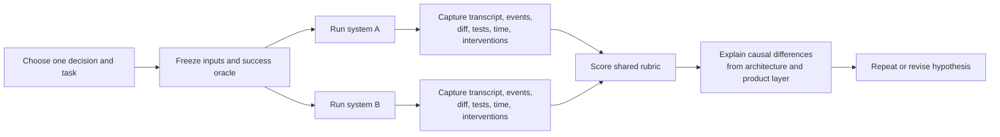

# Hands-on comparative study

## Why it matters

Architecture and market evidence predict behavior but do not measure task completion, operator effort, safety, or recoverability. A controlled study turns the curriculum's claims into falsifiable observations.

## Concrete anchor

Give DeepSeek Harness and one same-layer alternative the same small repository repair: locate a failing parser edge case, change only the necessary files, run the existing targeted tests, and explain the result. Freeze the model, repository revision, credentials, network policy, prompt, time limit, and success test before either run.

## Provisional mental model

Use a paired evidence loop rather than an open-ended demo.

The shared oracle matters more than identical prose: each system may express tools and state differently.

## Core concepts and mechanism

| Dimension | Observable evidence | Example scoring question |
| --- | --- | --- |
| Task outcome | Final tests, functional oracle, diff | Did it solve the requested problem without unrelated changes? |
| Model and run control | Exact model, temperature, retries, token limits | Can another evaluator reproduce the run conditions? |
| Tool fidelity | Tool arguments, results, errors, approvals | Are side effects and failures visible rather than inferred? |
| State and recovery | Session log, checkpoints, resume/fork behavior | Can the run continue or be reconstructed after interruption? |
| Safety boundary | Permissions, sandbox, network, secrets | Which dangerous operations were prevented, approved, or merely allowed? |
| Operator effort | Human interventions and corrections | How much expert steering was required? |
| Efficiency | Wall time, model calls, tokens, Tool calls | What resources produced the successful outcome? |
| Extensibility | Steps to replace or add a provider | Did the change use a stable seam or require a fork? |
| Product fit | Installation, UI, IDE/CLI, governance | Does the surface match the target buyer and workflow? |

1. Start with a decision, not a favorite product. “Choose an internal runtime” and “equip developers with a coding tool” require different competitors and rubrics.
2. Select a task with a deterministic success oracle: an existing failing test, expected API response, or exact repository invariant.
3. Freeze repository commit, model and endpoint, system prompt, allowed Tools, network, credentials, time and token budgets, human-intervention policy, and the grader definition itself, including evaluator data-source and testing criteria when API-based graders are used.
4. Keep task semantics equal while allowing adapter syntax to differ. Do not disadvantage one system by forcing it through another's Tool protocol.
5. Capture raw evidence: prompts, tool calls, results, approvals, errors, Session events, output files, diffs, test output, timings, retries, and human interventions. A SWE-bench-style bundle should retain its summary plus per-instance `report.json`, `test_output.txt`, `run_instance.log`, `eval.sh`, and `patch.diff`.
6. Score only after the runs. Mark missing evidence as unknown rather than zero, and separate functional failure from observability failure.
7. Explain differences through mechanisms: provider latency, event persistence, policy wrappers, product UX, or enterprise control plane—not just “the model was smarter.”
8. Repeat tasks and rotate order. One run is a case study, not a benchmark or market-share claim.

> [!CAUTION]
> Use a fresh `run_id` when a patch changes in a SWE-bench-style rerun. The harness caches by `run_id` and `instance_id`, so reuse can silently return prior results instead of evaluating the new patch.

> [!NOTE]
> OpenAI's current Evals page marks the Evals platform for deprecation, with read-only status planned for 2026-10-31 and shutdown planned for 2026-11-30. Treat its evaluator-design guidance as a current source retrieved on 2026-08-18, and verify the recommended platform before implementing a new study.

### Suggested study set

1. **Repository repair:** measures search, editing, testing, and recovery.
2. **New Tool integration:** measures Service Definition, Provider, Consumer, and policy seams.
3. **Interrupted Session:** measures event persistence, replay, resume, and projection.
4. **Denied operation:** measures approval, sandbox failure, and diagnostic clarity.
5. **Enterprise deployment review:** measures identity, networking, secrets, audit, lifecycle, and procurement evidence without pretending to deploy production infrastructure.

> [!WARNING]
> Do not use a single demonstration to rank the entire market. Report the repository revision, models, dates, prompts, budgets, failures, and evaluator interventions with every result.

## Refined mental model

The paired loop converts architectural and market hypotheses into inspectable evidence. Its limit is external validity: one repository, model, evaluator, or task cannot represent every workload. A sound conclusion states the exact decision and boundary: **under these frozen conditions, for this task and buyer, the observed mechanism produced this result**.

## Optional hands-on

Try it yourself

Run the repository-repair study with DeepSeek Harness and AgentScope if evaluating runtime composition, or with Qwen Code if evaluating developer workflow. Save the frozen protocol and grader definition before execution, use a unique run identifier, then produce an evidence bundle containing the raw transcript, diff, test output, per-instance artifacts, rubric scores, unknowns, and a short causal analysis.

## Checkpoint questions

1. Why choose a same-layer alternative before running the study?

Show answer 1

It keeps the buyer and job comparable. A runtime architecture study and an enterprise platform procurement study require different competitors, tasks, and success criteria.

2. Should a missing Session transcript receive the same score as a failed task?

Show answer 2

No. One is an observability or reproducibility gap; the other is a functional outcome. Record missing evidence as unknown and score the dimensions separately.

3. What conclusion is justified after one successful repair run?

Show answer 3

Only a bounded case-study conclusion for the recorded task, model, repository revision, policies, budgets, and evaluator. Repetition and broader tasks are required for benchmark claims.

## Primary sources

- [DeepSeek Harness architecture](https://github.com/deepseek-ai/deepseek-harness/blob/99f6f02fecdb7dff40c3fbc9470f5907c29f74ca/docs/architecture.md)
- [DeepSeek Harness development guide](https://github.com/deepseek-ai/deepseek-harness/blob/99f6f02fecdb7dff40c3fbc9470f5907c29f74ca/docs/development.md)
- [AgentScope](https://github.com/agentscope-ai/agentscope), retrieved 2026-08-18.
- [Qwen Code](https://github.com/QwenLM/qwen-code), retrieved 2026-08-18.
- [SWE-bench evaluation guide](https://www.swebench.com/SWE-bench/guides/evaluation/), retrieved 2026-08-18.
- [SWE-bench current CLI and harness](https://github.com/SWE-bench/SWE-bench), retrieved 2026-08-18.
- [OpenAI Evals design guidance and deprecation notice](https://developers.openai.com/api/docs/guides/evals), retrieved 2026-08-18.

## Navigation

- Prerequisite: [Global and China competition](09-global-and-china-competition.md)
- [Deep track](README.md)
- [Topic root](../README.md)
- [Knowledge index](../../README.md)
