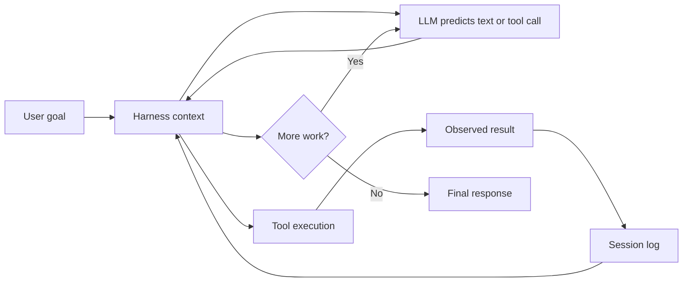

# Agent harness mental model

## Why it matters

To evaluate DeepSeek Harness, you must separate the LLM's prediction from the runtime that exposes context, validates actions, executes tools, records results, and decides whether another model request is needed.

## Concrete anchor

Imagine asking, “Find the failing test and fix it.” The model cannot inspect the repository by intent alone. It first needs a file or shell tool, then it must observe the tool result, decide what to read or edit next, and stop only after it has evidence that the task is complete.

## Provisional mental model

Treat the Harness as a stateful controller between a reasoning engine and an external environment. The model proposes; the Harness supplies observations, enforces available actions, and preserves the work history.

Read the loop clockwise: every external observation re-enters through the Harness rather than appearing magically inside the model.

## Core concepts and mechanism

1. The user goal becomes an input event and part of the next model context.
2. The Harness assembles the system prompt, selected model, available tools, and relevant session history.
3. The LLM returns assistant text, a tool call, or both; this output is a proposal rather than an already-executed side effect.
4. The tool registry validates the requested tool and arguments, then its execution pipeline applies permission or policy wrappers.
5. A provider performs the actual filesystem, shell, web, sandbox, or subagent operation.
6. The result or error is appended to the Session and becomes observable input for the next model request.
7. The Agent loop continues while consumable work remains and ends when it reaches a stopping condition.

The likely misconception is to attribute repository access or command execution to the model. The model only emits tokens; the Harness owns the executable contract.

## Refined mental model

The provisional “controller” model maps well to context assembly, tool dispatch, state transition, and stopping behavior. It is incomplete because DeepSeek Harness is not one central controller class: Cordis plugins contribute the loop, services, policies, providers, prompts, persistence, and UI. The operational model is therefore: **a scoped composition interprets a durable event stream and repeatedly turns model proposals into policy-governed observations**.

## Optional hands-on

Try it yourself

Take a short tool-using transcript and mark each line as user input, model proposal, Harness decision, provider side effect, observed result, or durable event. If a line cannot be reconstructed from the Session log, note that it would violate DeepSeek Harness's model-visible logging invariant.

## Checkpoint questions

1. Why can a stronger model not eliminate the need for a Harness?

Show answer 1

Model quality changes the proposals, but file access, command execution, permissions, persistence, error handling, and stopping behavior remain runtime responsibilities.

2. Where should a shell command result enter the next reasoning step?

Show answer 2

The provider returns it through the tool pipeline, it is logged as a Session event, and the Harness includes the resulting observation in a subsequent model context.

3. A product sends tool results directly to the next model call but does not log them. Which prediction from the refined model fails?

Show answer 3

Resume, fork, replay, and debugging can no longer reconstruct what the model observed, so the event stream is not the authoritative history.

## Primary sources

- [DeepSeek Harness architecture](https://github.com/deepseek-ai/deepseek-harness/blob/99f6f02fecdb7dff40c3fbc9470f5907c29f74ca/docs/architecture.md)
- [Agent loop package](https://github.com/deepseek-ai/deepseek-harness/tree/99f6f02fecdb7dff40c3fbc9470f5907c29f74ca/packages/core/agent-loop)

## Navigation

- [Quick track](README.md)
- Next: [Everything is a Plugin](02-everything-is-a-plugin.md)
- Related deep treatment: [Agent runtime foundations](../deep/01-agent-runtime-foundations.md)
- [Topic root](../README.md)
