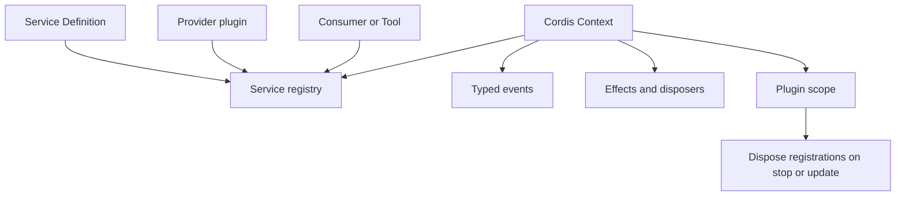

# Everything is a Plugin

## Why it matters

DeepSeek Harness differentiates itself by placing the model adapter, tool registry, Session log, Agent loop, providers, policies, and UI contributions behind plugin boundaries rather than allowing extensions only around a privileged core.

## Concrete anchor

Suppose one profile should use the local filesystem while another should route file operations through a sandbox. If the Agent loop depends on a filesystem service contract instead of a concrete implementation, changing the provider does not require editing the loop.

## Provisional mental model

Use a scoped switchboard model: `Context` exposes named connection points, plugins register capabilities and listeners, and the scope owns the cleanup of those registrations.

The diagram is about ownership, not security isolation: cleanup applies to registered effects, not arbitrary external consequences.

## Core concepts and mechanism

| Primitive | What it does | What to remember |
| --- | --- | --- |
| `Context` | Discovers services by stable keys such as `ctx.tools` or `ctx.sessions` | It is a scoped capability registry, not a global bag of utilities |
| Service | Defines a callable capability contract | Consumers should depend on the seam rather than a concrete provider |
| Event | Coordinates typed observations or interception | Waterfall listeners must delegate with `next()` unless intentionally stopping the chain |
| Effect | Registers work with a disposer | The registration can be undone when the plugin scope ends |
| Scope | Owns dependencies and lifecycle | Per-Session providers require isolation to avoid global conflicts |

1. A plugin declares hard dependencies through `inject` or reads optional capabilities with `ctx.get(name)`.
2. Its `apply()` function registers services, tools, events, slots, timers, or wrappers.
3. Those registrations return disposers or are owned through `ctx.effect()` and `ctx.on()`.
4. Cordis can wait for missing hard dependencies and reactivate the plugin when they appear.
5. Stopping, updating, or removing a plugin disposes the registrations owned by its scope.
6. A different provider can satisfy the same seam without changing the consumer.

## Refined mental model

The switchboard model correctly predicts replaceability and cleanup, but it does not mean every plugin is interchangeable or safe. Service contracts, event modes, configuration, scope selection, and external side effects still matter. The reliable rule is: **composition is reversible only for effects that participate in the Cordis lifecycle, and capability completeness requires Definition, Provider, and Consumer roles**.

## Optional hands-on

Try it yourself

Open the base profile patch and identify one seam, its provider, and its model-facing consumer. Then imagine removing the provider plugin: predict whether the consumer waits, handles absence, or fails configuration, and verify the relevant dependency declaration.

## Checkpoint questions

1. Why is “supports plugins” an insufficient description of DeepSeek Harness?

Show answer 1

Many products add tools around a fixed engine; DeepSeek Harness places core runtime responsibilities behind plugin services and lifecycle-managed registrations.

2. When should a dynamic plugin use `ctx.get()` instead of `inject`?

Show answer 2

Use `ctx.get()` when the capability is optional and absence can be handled. Use `inject` when the plugin must wait and reactivate only after a true hard dependency appears.

3. A plugin writes a remote ticket and is then disposed. Does effect disposal undo the ticket?

Show answer 3

No. Disposal removes registered listeners, services, timers, or subscriptions; it does not automatically compensate an external system side effect.

## Primary sources

- [Cordis primer](https://github.com/deepseek-ai/deepseek-harness/blob/99f6f02fecdb7dff40c3fbc9470f5907c29f74ca/docs/cordis-primer.md)
- [Repository instructions](https://github.com/deepseek-ai/deepseek-harness/blob/99f6f02fecdb7dff40c3fbc9470f5907c29f74ca/AGENTS.md)
- [Editing Cordis compositions Skill](https://github.com/deepseek-ai/deepseek-harness/blob/99f6f02fecdb7dff40c3fbc9470f5907c29f74ca/apps/cli/config/agent-presets/cordis/skills/editing-cordis-compositions/SKILL.md)

## Navigation

- Prerequisite: [Agent harness mental model](01-agent-harness-mental-model.md)
- [Quick track](README.md)
- Next: [Session-driven runtime](03-session-driven-runtime.md)
- Related deep treatment: [Cordis plugin model](../deep/02-cordis-plugin-model.md)
- [Topic root](../README.md)
