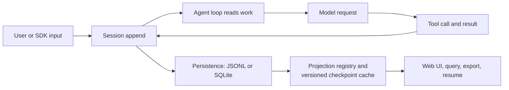

# Session-driven runtime

## Why it matters

The Session log explains why CLI, Web, headless, ACP, and SDK surfaces can share one runtime semantics and why model-visible inputs must be recorded rather than hidden in transient process state.

## Concrete anchor

An Agent reads a failing test, edits a file, and then the process restarts. A reliable resume needs more than the last assistant message: it needs the user goal, model-visible context changes, tool calls, tool results, approvals, and checkpoints that shaped the next decision.

## Provisional mental model

Think of the Session as an append-only ledger and every UI or query as a view derived from that ledger.

The arrows separate facts from views: projections can be rebuilt, while unlogged model input cannot.

## Core concepts and mechanism

1. Inputs and control actions are appended to the Session.
2. The Agent loop consumes relevant events and constructs runtime context.
3. Assistant chunks, tool calls, results, errors, `request/header`, and `request/context` become additional events so model selection and context routing can be reconstructed.
4. A checkpoint policy marks semantic progress without replacing the underlying history.
5. Persistence coordinates revision and write-behind storage through JSONL or SQLite backends.
6. Projection providers compute views such as conversation state, goals, todos, titles, search, or telemetry. The cache stores versioned unit state for replay, not a rendered UI view.
7. Resume and fork operate from the same event source rather than copying an unrelated UI state.

| Entry | Transport or surface | What it reuses | Boundary |
| --- | --- | --- | --- |
| CLI | Process command and selected profile | Agent, Session, Tools, providers | Broad composition entry |
| Web | HTTP POST up; separate `events.mux` and `events.host` WebSockets down | Same core through Host and Client projections | Browser is not a second Agent core |
| Headless | Direct one-shot startup | Base Agent and Session capabilities | No Host, HTTP, or browser |
| ACP | Newline-delimited JSON-RPC over stdio | Core runtime for automation | Separate from Web transport |
| TypeScript/Python SDK | Out-of-process runtime control | Loop and Session projections | TypeScript callers supply the runtime; Python defaults to a bundled subprocess |

## Refined mental model

The ledger model correctly predicts replay and projection, but append-only does not automatically mean tamper-proof, compliant, or infinitely retained. The useful invariant is narrower: **anything that affects what the model sees must be reconstructable from the Session event stream, and derived views must not become a competing source of truth**.

## Optional hands-on

Try it yourself

Sketch the minimum events needed to resume a three-step tool task after a crash. Then remove the tool result event and explain which next-step decision can no longer be reconstructed.

## Checkpoint questions

1. Why is the last assistant message insufficient for resume?

Show answer 1

The next decision may depend on tool results, approvals, context changes, or checkpoints that are not contained in the message.

2. What is the difference between a Session event and a projection?

Show answer 2

The event is durable source data about what happened; the projection is a derived view optimized for a consumer such as the UI or search.

3. If a browser reconnects, which part of the model predicts that it can recover state?

Show answer 3

The browser can request or receive projections derived from the durable Session and persistence layers rather than relying only on its previous in-memory state.

## Primary sources

- [DeepSeek Harness architecture](https://github.com/deepseek-ai/deepseek-harness/blob/99f6f02fecdb7dff40c3fbc9470f5907c29f74ca/docs/architecture.md)
- [Session persistence](https://github.com/deepseek-ai/deepseek-harness/tree/99f6f02fecdb7dff40c3fbc9470f5907c29f74ca/packages/session/session-persistence)
- [Headless bundle](https://github.com/deepseek-ai/deepseek-harness/tree/99f6f02fecdb7dff40c3fbc9470f5907c29f74ca/packages/bundle/headless)
- [Client connection transports](https://github.com/deepseek-ai/deepseek-harness/blob/99f6f02fecdb7dff40c3fbc9470f5907c29f74ca/packages/client/connection/README.md)
- [TypeScript SDK boundary](https://github.com/deepseek-ai/deepseek-harness/blob/99f6f02fecdb7dff40c3fbc9470f5907c29f74ca/packages/sdk/README.md)
- [Python SDK boundary](https://github.com/deepseek-ai/deepseek-harness/blob/99f6f02fecdb7dff40c3fbc9470f5907c29f74ca/python/README.md)

## Navigation

- Prerequisite: [Everything is a Plugin](02-everything-is-a-plugin.md)
- [Quick track](README.md)
- Next: [Global and China market lens](04-market-lens.md)
- Related deep treatment: [Agent loop and Session events](../deep/04-agent-loop-and-session-events.md)
- [Topic root](../README.md)
