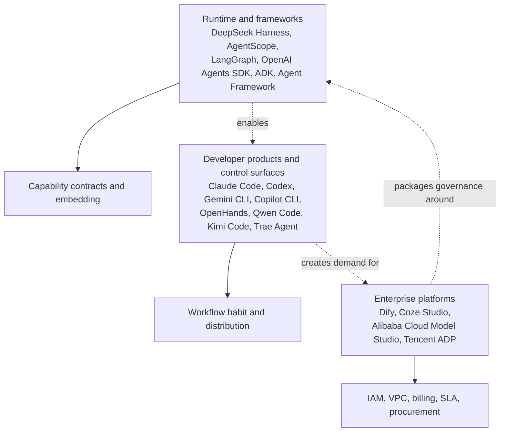

# Global and China market lens

## Why it matters

DeepSeek Harness can be misjudged if it is compared only with a coding CLI or only with a general Agent framework. Its opportunity and risk depend on which layer owns the runtime, user experience, and enterprise control plane.

## Concrete anchor

A GitHub repository receives more than 150,000 stars shortly after launch, thousands of forks, and a surge in package downloads. That proves attention and experimentation, but it does not tell a buyer whether teams retain it, operate it under an SLA, or pass enterprise security review.

## Provisional mental model

Use a three-layer market map: runtime and framework projects win through contracts and embedding, developer products win through experience and distribution, and enterprise platforms win through governance and procurement.

The overlap explains why a feature checklist alone is misleading: products can cross layers while optimizing for different buyers.

## Core concepts and mechanism

| Lens | International examples | China examples | Evidence to demand |
| --- | --- | --- | --- |
| Runtime and framework | LangGraph, OpenAI Agents SDK, Google ADK, Microsoft Agent Framework, DeepSeek Harness | AgentScope, DeepSeek Harness | Stable contracts, state, evaluation, embedding, provider ecosystem, upgrade policy |
| Developer product or control surface | Claude Code, Codex, Gemini CLI, Copilot CLI, OpenHands Agent Canvas | Qwen Code, Kimi Code, Trae Agent | Active use, retention, workflow integration, task success, support |
| Enterprise Agent platform | Managed application and control-plane offerings | Dify, Coze Studio, Alibaba Cloud Model Studio, Tencent ADP | IAM, VPC, audit, SLA, procurement and deployment support |

1. DeepSeek Harness's deep plugin boundary creates differentiation for platform builders.
2. AgentScope and general Agent frameworks are close architectural comparisons; OpenHands Agent Canvas and large-vendor CLIs are closer developer-product or control-surface comparisons.
3. In China, AgentScope competes at the runtime layer, Qwen Code and similar products compete for developer entry, and cloud Agent platforms compete for enterprise budget.
4. Stars, forks, downloads, and plugin repositories indicate attention or supply, not retention, revenue, production reliability, or enterprise adoption.
5. The strongest near-term use cases are controlled experiments, internal platforms, white-label products, and evaluation or governance systems.
6. The gates are API stability, trusted plugin supply, enterprise identity and isolation, audit, support, and proven operations.

## Refined mental model

The three-layer map is useful for choosing competitors and evidence, but it is not a permanent taxonomy. Products can move upward into managed enterprise platforms or downward into reusable runtimes. The operational decision rule is: **compare a product with the alternatives that compete for the same user, integration surface, and budget, then separate attention metrics from production evidence**.

## Optional hands-on

Try it yourself

Choose one international and one China-market alternative. Place each in the layer where it currently wins, name its buyer, and list one metric that would prove sustained adoption rather than launch attention.

## Checkpoint questions

1. Why is LangGraph not a direct substitute for every DeepSeek Harness use case?

Show answer 1

LangGraph is a general orchestration runtime, while DeepSeek Harness also supplies an assembled coding Agent, tools, sessions, providers, UI, and product entry points.

2. What does a high fork count support, and what does it not support?

Show answer 2

It supports strong experimentation or modification interest. It does not establish retention, enterprise deployment, revenue, reliability, or support quality.

3. A company needs SSO, VPC deployment, audit retention, and a support contract. Which market layer should dominate its comparison?

Show answer 3

The enterprise Agent platform layer should dominate because the budget and acceptance criteria concern control-plane and procurement capabilities, not only runtime composability.

## Primary sources

- [DeepSeek Harness repository metadata](https://api.github.com/repos/deepseek-ai/deepseek-harness), retrieved 2026-08-18.
- [DeepSeek Harness releases](https://github.com/deepseek-ai/deepseek-harness/releases), retrieved 2026-08-18.
- [OpenHands Agent Canvas](https://github.com/OpenHands/OpenHands), retrieved 2026-08-18.
- [Qwen Code](https://github.com/QwenLM/qwen-code), retrieved 2026-08-18.
- [AgentScope](https://github.com/agentscope-ai/agentscope), retrieved 2026-08-18.
- [Tencent ADP deployment documentation](https://cloud.tencent.com/document/product/1759/128512), retrieved 2026-08-18.

## Navigation

- Prerequisite: [Session-driven runtime](03-session-driven-runtime.md)
- [Quick track](README.md)
- Related deep treatment: [Global and China competition](../deep/09-global-and-china-competition.md)
- [Topic root](../README.md)
